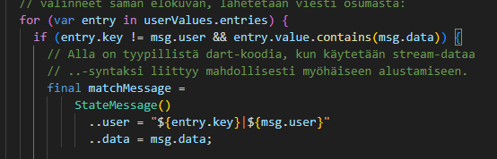
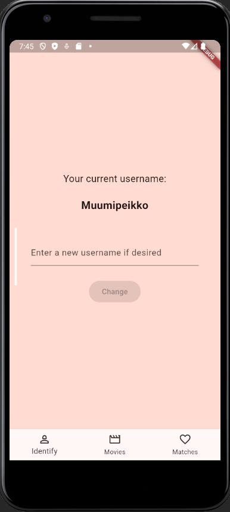
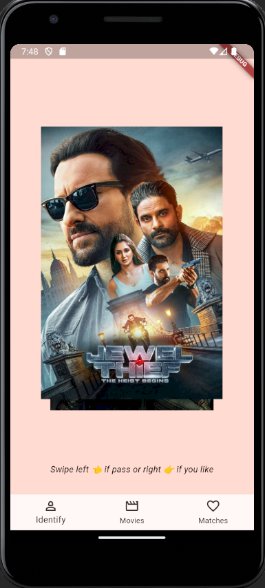
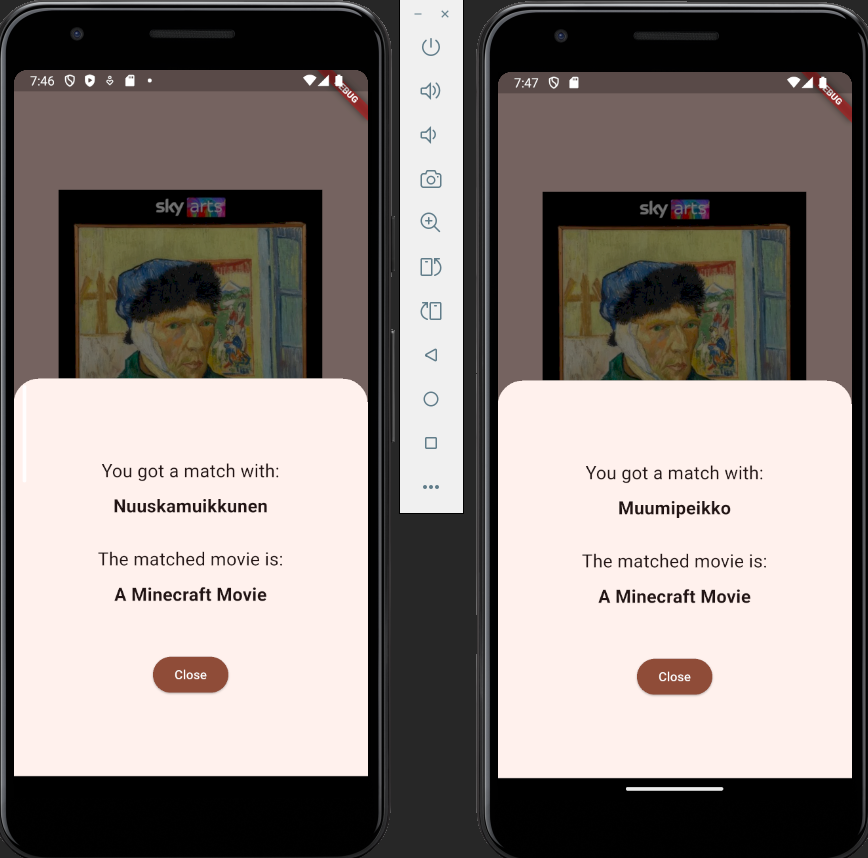
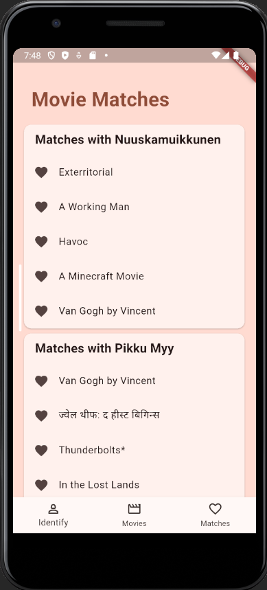
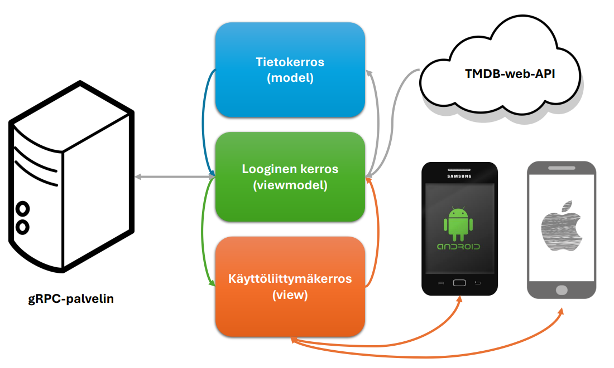

# Movie Match -Flutter-sovellus

Cross-Platform Mobile Application Development -opintojakson tehtävä, joka vaatii taustalle [gRPC-palvelinohjelman] pienin muokkauksin. Muokkaukset on tehtävä lib/moviematch_server.dart-tiedostossa olevan MovieMatchService-luokan streamState-metodin request-parametrin listen-metodikutsun parametrina olevan callback-funktion toteutusosan for-silmukkaan. Silmukan ehtolauseen toteutusosasassa olevan matchMessage-muuttujan on oltava kuvan 1 mukainen.

## Sovellus

Aloitusnäkymä, jossa käyttäjänimi on mahdollista vaihtaa:

Elokuvien selausnäkymä:

Kun vähintään kaksi eri käyttäjää on tykännyt samasta elokuvasta, ilmoittaa sovellus tästä ponnahtavan modaalisivun avulla:

Näkymä, jossa voi vastapuolikohtaisesti tarkastella elokuvia, joista on yhteisesti tykätty:

## Arkkitehtuuri

## Puutteet
- Sovelluksen käyttöliittymä ei vielä skaaladu vaakatasoon
- Sovellus ei toimi tällä hetkellä selainpohjaisesti
